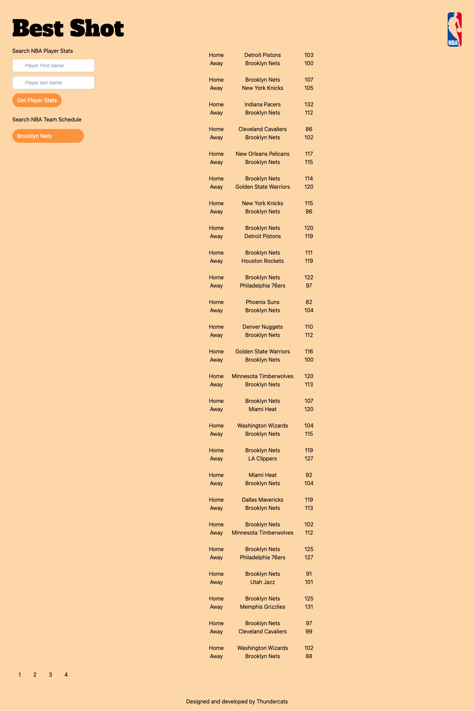

# Project 1 - Best Shot

## Description

Best Shot is an NBA search database application used to search individual player stats, as well as current team game stats. User who navigate to Best Shot are given the option to either search players with 2 input boxes (one for first name, one for last name.) Underneath the player search input boxes, there is a dynamic drop down menu with every current team in the NBA and when selected, the user is presented with that team's 25 most recent games. If there are more than 25 game search results, at the bottom of the page, there is a pager function when dynamically populates, giving the user the opportunity to search multiple pages of game stats.

## The Team

- Stephen Marr: [Stephen Marr's personal github](https://github.com/smarr2198)
- Mousa Haddadin: [Mousa Haddadin's personal github](https://github.com/mhaddadin1)
- Brian Holbrook: [Brian Holbroook's personal github](https://github.com/holbrookb23)
- Gwen Ewasko: [Gwen Ewasko's personal github](https://github.com/gwenewasko)

## API Used

[Ball Don't Lie](https://www.balldontlie.io/#introduction)

## Project Presentation

[Link to project presentation](https://docs.google.com/presentation/d/1Q8G8wjesUVlmWYUHw0niuOSbPpcZwKFZBPVU9FKmSoA/edit?usp=sharing)

## Screenshot

## Links to Application

- Here is the link to the repo: [thundercats-4ever/repo](https://github.com/thundercats-4ever/project)
- Here is the link to the pages: [thundercats-4ever/pages](https://thundercats-4ever.github.io/project/)
