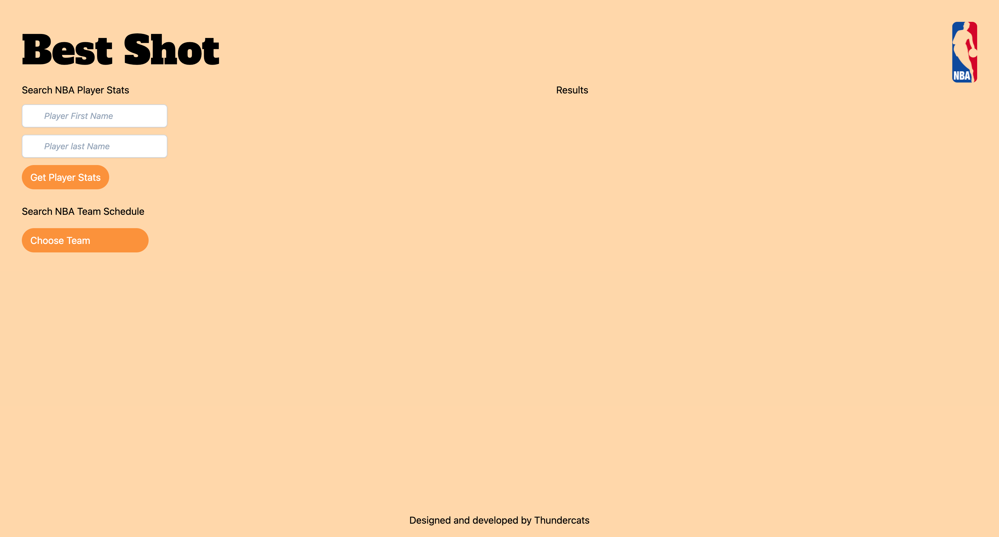

# Project 1

## Description

This is Thundercats-4ever's first project that uses a 3rd party API to display sport stats.

This Application is used to get individual player stats, as well as individual team games/schedules. This application will start at a blank screen with input boxes on the left side if you would like to search for an individual player's stats. Underneath that there will be a drop down box with every team in the NBA and you can look up their 25 most recent games. All games of the season will be saved in this API and by using the page numbers at the bottom that will allow you to look at games further in the past.

## Screenshot

## Links to Application

- Here is the link to the repo: [thundercats-4ever/repo](https://github.com/thundercats-4ever/project)
- Here is the link to the pages: [thundercats-4ever/pages](https://thundercats-4ever.github.io/project/)
